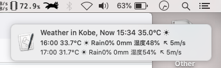

# MacOS Notification app

Public repository for notif branch, which is for MacOS env.

To display as a notification do: 
	$ /bin/bash grep_tenki.sh
	$ osascript -l JavaScript notif_app.js

## xbar plugin:
Fetch current weather data from weathernews.jp

Add *currWeather.1h.sh* to your plugins folder and set Refresh to 1hr

## Extra info
Toggle betwen dark and light mode in MacOS 10.15 
	$ osascript -e 'tell app "System Events" to tell appearance preferences to set dark mode to not dark mode'

## Environment
- MacBookPro, MacOS 15.5
- Editors: Emacs and VIM
