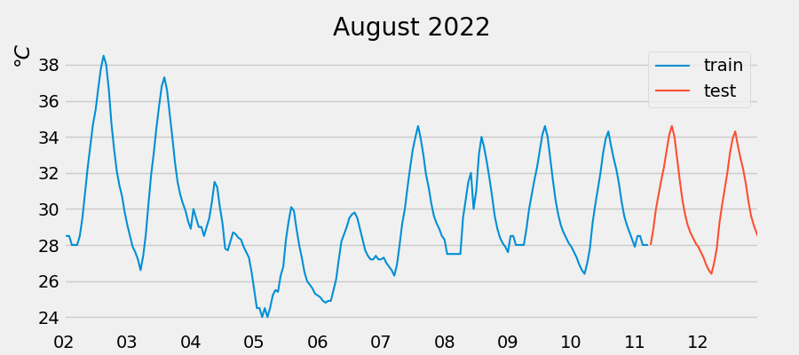

# Forecast weather data with skforecast library and scikit-learn

Data to be trained should have no gaps, if there are gaps, fill them with Pandas, by adding the previous number or *np.nan*.

Please refer to the following [link](https://www.cienciadedatos.net/documentos/py27-time-series-forecasting-python-scikitlearn.html)

Sample data: weather for Kobe city on August 2022

## Dependencies

Python3.10 on Fedora 36:
- numpy: v1.23.3
- pandas: v1.4.4
- scipy: v1.9.1
- matplotlib: v3.5.2
- scikit-learn: v1.1.2
- skforecast: v0.4.1

Issue regarding installation of current version of skforecast: 
    $ pip install skforecast
    
Returns an error related to python and numpy being deprecated (in spite of using 3.10 and v1.23.0). It says that numpy.distutils is no longer used on python >=3.12. To fix this error better install the following version:  
    $ pip install skforecast==0.4.1
